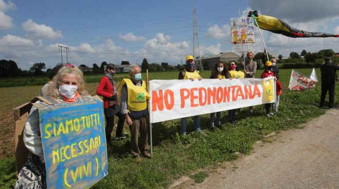

La regione Lombardia sta cercando in tutti i modi di proseguire i lavori ormai abbandonati nonostante il totale disinteresse degli investitori privati, che non individuano alcuna possibilità di trarre profitto da un progetto fallimentare.

Nonostante questo, **siamo ancora in tempo per fermare il disastro**! Possiamo prevenire gli enormi danni che Pedemontana provocherà e spostare gli investimenti di soldi pubblici in [progetti alternativi e validi](/proposte/).

#### Se sei contrario al progetto della pedemontana lombarda puoi:

- Sostenere [una delle associazioni più vicine a te]().

- Firmare la petizione europea, la petizione online e partecipa alle raccolte firme ai banchetti.

	- **[Petizione al Parlamento Europeo n. 0321/2020 contro la costruzione di una tratta autostradale](https://www.europarl.europa.eu/petitions/it/petition/content/0321%252F2020/html/Petizione-n.-0321%252F2020%252C-presentata-da-R.G.P.%252C-cittadino-italiano%252C-a-nome-di-%2527%2527No-alla-costruzione-dell%2527A.P.L.%2527%2527%252C-corredata-di-23-firme%252C-contro-la-costruzione-di-una-tratta-autostradale)**

	- **[Raccolta firme FERMIAMO PEDEMONTANA !](https://www.change.org/p/regione-lombardia-fermiamo-pedemontana)**

- Seguire sui social network i coordinamenti contro pedemontana e partecipare alle proteste.

{: width="100%" }
